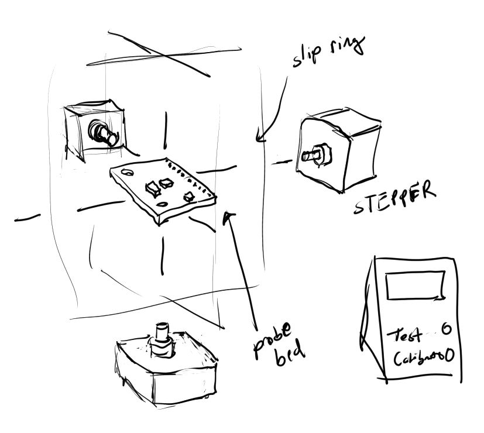

### imu library
https://github.com/Intelligent-Vehicle-Perception/MPU-9250-Sensors-Data-Collect

### 03/14/2021
Have a bit to go on this, more research on IMUs in general and then do the coordinate rotation stuff.

I did have a thought for "batch testing" these sensors. Or at least a faster way. You'd need a testing "jig" that is a 3-axis stepper rotation thing. Then you would in theory just plop the IMU in, hit the button on the panel and it would rotate the IMU on all 3 axes and verify stuff. I think you'd need linear ones too for accel vs. gyro... maybe that's why those aren't made.

### 03/11/2021

Forgot how I have to do all this `wpa_supplicant` and `ssh` stuff when setting up the Pi.
The Pi also has male headers ugh.

Minimum goals today are to see the values reflect my physical movements. Then start to work out the rotation. Will start with a box moving based on IMU position.

Hopefully can display it live to a web app that has a socket running/showing ThreeJS.

Ooh... so the Pi on SLAM-crappy is already using the SDA/SCL lines for i2c.

### initial problems
smbus2, i2c enable

Had to resolder I guess, I tried a second one thought first one was dead, resoldered pins, worked
Nope it's actually dead hmm

### Charting
I wanted to plot the values in real time... landed on PyQtGraph
Nope, no GUI for headless Pi forgot
