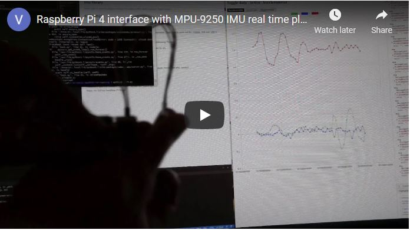

### About
This is a basic interface test of the MPU9250 IMU which I'm using in some projects related to SLAM.

I'm using the MPU9250 library [here](https://github.com/Intelligent-Vehicle-Perception/MPU-9250-Sensors-Data-Collect) and I'm using [ChartJS](https://www.chartjs.org/docs/latest/) to plot the data. This is primarily a visual/calibration thing not really caring about accuracy just "it changed in this direction".

See video below demoing it.

### How to use
You will have to move some of this code over to your Pi which is connected to your MPU sensor. Install the related dependencies(note needs Python 3). Then just run the `sensor-read-websocket-server.py` file. You may want to test the values first before hand `and/or` run the sensor calibration stuff. This is just a minor tool for me so I didn't really spend much time on it.

The web page you'd have to open on your computer/device after running the python script above. It doesn't really matter which one runs first, as the browser keeps trying to connect to the socket server over and over.